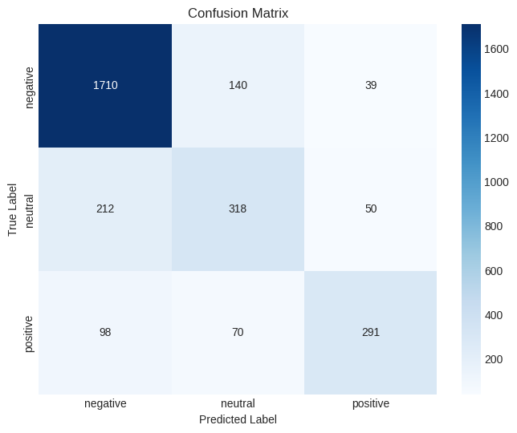

# US Airline Sentiment Analysis with Deep Learning (NLP)

[](https://www.python.org/)
[](https://www.tensorflow.org/)
[](https://keras.io/)
[](https://opensource.org/licenses/MIT)
[](https://www.kaggle.com/datasets/crowdflower/twitter-airline-sentiment)

 
<!-- Optional: You can create a banner image for your project and add it here -->

This repository contains the capstone project for the "Natural Language Processing (NLP) with Deep Learning" course from BISA AI Academy. The project focuses on building and evaluating a Long Short-Term Memory (LSTM) model to perform sentiment analysis on tweets directed at major US airlines.

---

## 📋 Table of Contents

*   [Overview](#-overview)
*   [Project Workflow](#-project-workflow)
*   [Dataset](#-dataset)
*   [Repository Structure](#-repository-structure)
*   [Installation & Usage](#-installation--usage)
*   [Results & Performance](#-results--performance)
*   [Future Enhancements](#-future-enhancements)
*   [License](#-license)

---

## 📝 Overview

In today's interconnected world, social media platforms like Twitter are a primary channel for customers to share their experiences and opinions. For the airline industry, this feedback is invaluable for improving service quality. However, the sheer volume of this data makes manual analysis impractical.

This project addresses this challenge by implementing an LSTM-based deep learning model to automate the sentiment classification of customer tweets into three distinct categories: **positive**, **negative**, or **neutral**. The final model successfully identifies customer sentiment, with a particular strength in detecting negative feedback, providing airlines with a powerful tool for monitoring public perception.

---

## 🚀 Project Workflow

The project is structured into a logical sequence, documented within the Jupyter Notebooks, from data ingestion to model evaluation:

1.  **Data Loading & Initial Exploration**:
    *   The `Tweets.csv` dataset is loaded into a Pandas DataFrame.
    *   Initial analysis is performed to understand its structure, data types, and check for missing values.

2.  **Exploratory Data Analysis (EDA)**:
    *   Visualizations are created to understand the distribution of sentiments across the entire dataset and on a per-airline basis.
    *   The analysis reveals a significant imbalance, with negative tweets being the most frequent class. This context is crucial for interpreting model performance.

3.  **Text Preprocessing**:
    *   A comprehensive text cleaning pipeline is applied to the raw tweets to prepare them for the model. This includes:
        *   Removing URLs, mentions (`@username`), and hashtags (`#`).
        *   Converting text to lowercase.
        *   Stripping punctuation and numbers.
        *   Tokenizing text into individual words.
        *   Removing common English stopwords (e.g., "the", "is", "a").

4.  **Data Preparation for Modeling**:
    *   The cleaned text data is converted into numerical sequences using the Keras `Tokenizer`.
    *   Sequences are padded to ensure a uniform input length (`maxlen`) for the LSTM model.
    *   The target labels (sentiments) are one-hot encoded.

5.  **Model Architecture & Training**:
    *   A Sequential model is built using TensorFlow/Keras with the following layers:
        *   `Embedding` layer to learn dense vector representations of words.
        *   `LSTM` layer with dropout to capture sequential patterns in the text.
        *   `Dropout` layer to prevent overfitting.
        *   `Dense` output layer with `softmax` activation for multi-class classification.
    *   The model is trained with **Early Stopping** to monitor validation loss and prevent overfitting.

6.  **Performance Evaluation**:
    *   The trained model is evaluated on a held-out test set.
    *   Performance is measured using overall accuracy, a detailed `classification_report` (precision, recall, F1-score), and a `confusion_matrix`.

---

## 📊 Dataset

The project utilizes the **"Twitter US Airline Sentiment"** dataset, originally sourced from Crowdflower's Data for Everyone library and made available on Kaggle.

*   **Source**: [Kaggle Dataset Link](https://www.kaggle.com/datasets/crowdflower/twitter-airline-sentiment)
*   **Size**: ~14,640 labeled tweets from February 2015.
*   **Key Feature**: `text` (The content of the tweet)
*   **Target Label**: `airline_sentiment` (Positive, Negative, Neutral)

---

## 📁 Repository Structure

This project follows a standardized and modular structure for maximum clarity, reproducibility, and ease of navigation. Below is a robust layout using nested lists that renders cleanly across all platforms.
📂 data/ — Houses all datasets used in the project.
raw/ — Contains the original, untouched dataset.
📄 Tweets.csv: The raw sentiment dataset sourced from Kaggle.
processed/ — Contains cleaned and prepared data ready for modeling.
📊 Tweets_processed.csv: The dataset after applying the text preprocessing pipeline.
📂 models/ — Stores the final, trained model and associated artifacts.
🤖 lstm_sentiment_model.h5: The saved and trained Keras LSTM model file, ready for inference.
🗃️ tokenizer.pickle: The Tokenizer object fitted on the training data, essential for correctly processing new text.
📂 notebooks/ — The heart of the project's analysis and modeling.
📓 main_notebook.ipynb: A comprehensive Jupyter Notebook that details every step from data loading and EDA to model training, evaluation, and prediction.
📂 reports/ — Contains all generated outputs like visualizations.
figures/ — A collection of all saved charts and plots.
🖼️ sentiment_distribution.png
🖼️ sentiment_by_airline.png
🖼️ confusion_matrix.png
📜 LICENSE — The MIT License file, defining the permissions and limitations for this project.
📝 README.md — This comprehensive and structured project overview.
📋 requirements.txt — A list of all Python libraries required to replicate the environment. Can be installed with pip install -r requirements.txt.
---

## 💻 Installation & Usage

To replicate this project locally, follow these steps:

1.  **Clone the Repository**
    ```bash
    git clone https://github.com/[Your GitHub Username]/airline-sentiment-nlp-capstone.git
    cd airline-sentiment-nlp-capstone
    ```

2.  **Set Up a Virtual Environment (Recommended)**
    ```bash
    python -m venv venv
    source venv/bin/activate  # On Windows, use: venv\Scripts\activate
    ```

3.  **Install Dependencies**
    ```bash
    pip install -r requirements.txt
    ```
    This will install all necessary libraries, including Pandas, TensorFlow, NLTK, and Scikit-learn.

4.  **Download NLTK Data**
    The first time you run the notebook, it will automatically download the `punkt` and `stopwords` packages from NLTK.

5.  **Run the Jupyter Notebook**
    Launch Jupyter and open `main_notebook.ipynb` from the `notebooks/` directory to explore the code and results.
    ```bash
    jupyter notebook
    ```

---

## 📈 Results & Performance

The trained LSTM model demonstrates a strong ability to classify tweet sentiment, achieving a **test accuracy of 79.20%**.

#### **Classification Report:**

The model excels at identifying negative tweets, which is often the most critical class for business applications.

| Sentiment | Precision | Recall | F1-Score | Support |
|:----------|:---------:|:------:|:--------:|:-------:|
| **Negative**  |   0.85    |  0.91  |   0.87   |   1889  |
| **Neutral**   |   0.60    |  0.55  |   0.57   |    580  |
| **Positive**  |   0.77    |  0.63  |   0.69   |    459  |

#### **Confusion Matrix:**

The confusion matrix visually confirms the model's performance. The strong diagonal for the "Negative" class shows a high number of correct predictions.



#### **Key Insights:**
*   **High Negative Sentiment Detection**: The model's high recall (0.91) for negative tweets makes it a reliable tool for flagging customer complaints.
*   **Challenge with Neutral Tweets**: The lower F1-score (0.57) for neutral tweets highlights a common challenge in NLP. Neutral language often lacks strong sentiment markers, making it harder for the model to classify correctly.
*   **Impact of Early Stopping**: The training log shows that Early Stopping halted training after 5 epochs, preventing overfitting and leading to a more robust model.

---

## 🌱 Future Enhancements

While the current model performs well, several avenues exist for future improvement:

*   **Hyperparameter Tuning**: Systematically optimize hyperparameters (e.g., embedding dimensions, LSTM units, learning rate) using techniques like KerasTuner or GridSearch to potentially boost performance.
*   **Advanced Architectures**: Experiment with more complex architectures like bidirectional LSTMs (BiLSTM), GRUs, or fine-tuning pre-trained Transformer models (e.g., BERT) for deeper contextual understanding.
*   **Addressing Class Imbalance**: Employ techniques such as class weighting during training or oversampling/undersampling to improve performance on minority classes (neutral and positive).
*   **Deployment as an API**: Package the trained model and tokenizer into a REST API using Flask or FastAPI, allowing for real-time sentiment analysis on new tweets.

---

## 📜 License

This project is licensed under the **MIT License**. See the `LICENSE` file for more details.
